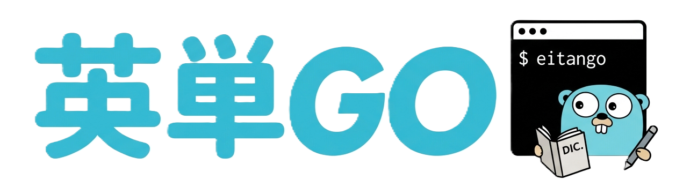
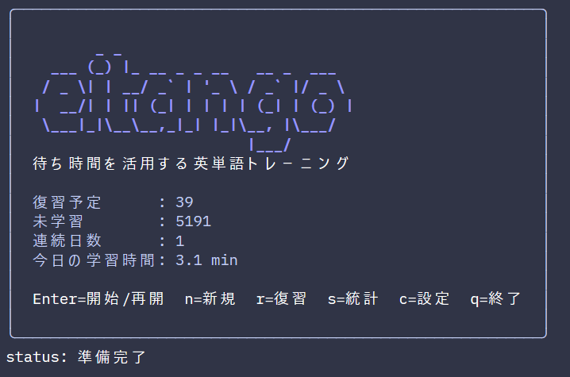
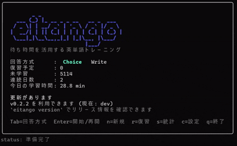
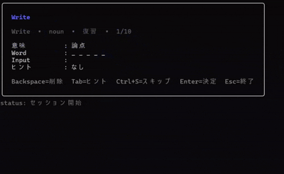

<p align="center">
    
</p>

<p align="center">
  <em>eitango - TUI English Vocabulary Tool</em>
</p>

<div align="center" style="max-width: 600px; margin: auto;">

    []()  [](https://github.com/harumiWeb/eitango/actions/workflows/ci.yml) [](https://app.codacy.com/gh/harumiWeb/eitango/dashboard?utm_source=gh&utm_medium=referral&utm_content=&utm_campaign=Badge_grade)

</div>

---

# eitango

`eitango` is an offline English vocabulary trainer with a terminal UI. It uses Bubble Tea for the interactive interface and a local SQLite database for progress tracking.

In addition to SRS-based review, it offers two modes: multiple-choice `choice` and input-based `write`.　Audio playback is also supported.

The embedded vocabulary currently contains about **5200** words, and external dictionary import from CSV / JSONL is also supported. The tool includes learning statistics, progress management, update notifications, and diagnostic tools.

[日本語README](README.md)



## What It Can Do

- `eitango` opens the home screen, where you can choose modes and change settings in the TUI

<p align="center">
  
</p>
<p align="center">
  <em>choice mode</em>
</p>

<p align="center">
  
</p>
<p align="center">
  <em>write mode</em>
</p>

- on the home screen, `Tab` switches `choice / write`, `Enter` starts play, and `r` starts review
- the home settings screen can switch Write difficulty between `basic` and `hard`
- on macOS / Windows, `Ctrl+P` plays the current word and `Shift+Tab` toggles session-local autoplay
- `eitango play [choice|write]` starts a standard learning session
- `eitango review [choice|write]` starts a due-only review session
- `eitango stats` shows learning statistics
- `eitango version` shows the current build info and the latest release
- `eitango doctor` runs read-only diagnostics on the DB and dictionary
- `eitango validate` validates the embedded dictionary or external CSV / JSONL files
- `eitango import` / `eitango export` / `eitango reset` maintain dictionaries and learning progress

## Installation

### 1. Use `curl | sh` on macOS / Linux

`install.sh` calls the GitHub Releases API (`/releases/latest`) when `--version` is omitted to resolve the latest version, then downloads the matching GitHub Release archive and `checksums.txt`. It installs into `~/.eitango/` only after the SHA256 check passes, and it never edits shell rc files automatically.

```bash
curl -fsSL https://raw.githubusercontent.com/harumiWeb/eitango/main/install.sh | sh
```

To pin a specific version:

```bash
curl -fsSL https://raw.githubusercontent.com/harumiWeb/eitango/main/install.sh | sh -s -- --version v0.2.0
```

The installer writes:

- `~/.eitango/bin/eitango`
- `~/.eitango/version`
- `~/.eitango/share/`

Legal notices are kept under `~/.eitango/share/`. If `~/.eitango/bin` is not already on PATH, add:

```bash
export PATH="$HOME/.eitango/bin:$PATH"
```

If you want to inspect the script before running it:

```bash
curl -fsSLo install.sh https://raw.githubusercontent.com/harumiWeb/eitango/main/install.sh
sh install.sh --version v0.2.0
```

To uninstall the installer-managed files while keeping study data:

```bash
curl -fsSL https://raw.githubusercontent.com/harumiWeb/eitango/main/install.sh | sh -s -- --uninstall
```

To also delete the data directory, add `--purge-data`. If you use `EITANGO_DATA_DIR`, pass the same env var when uninstalling.

```bash
curl -fsSL https://raw.githubusercontent.com/harumiWeb/eitango/main/install.sh | sh -s -- --uninstall --purge-data
```

Required tools are `sh`, `curl`, `tar`, `mktemp`, and one of `sha256sum`, `shasum`, or `openssl`. Windows is out of scope for this installer, so use the release zip there.

### 2. Use GitHub Releases

Published archives include the executable plus `LICENSE`, `THIRD_PARTY_NOTICES.md`, and `third_party/licenses/`. Extract the artifact for your OS and run `eitango`.

※ You need to manually add it to your `PATH`.

### 3. Install with Go

Go 1.26 or newer is required.

```bash
go install github.com/harumiWeb/eitango/cmd/eitango@latest
```

Builds installed with `go install` also report the embedded module version in `eitango version`.

## Quick Start

```bash
eitango
```

You can also start directly in a specific mode.

```bash
eitango play
eitango play write
eitango review --focus-mode
eitango review write
eitango stats
eitango version
eitango doctor
```

`eitango learn` remains as a backward-compatible alias, but `eitango play` is now the canonical form in the docs.

On first run, `eitango` initializes the local database. By default it uses the embedded `assets/words_core.jsonl` as the seed dictionary.

## Write Difficulty

- `write_mode_difficulty = "basic"` is the default
- in `basic`, Learn + Write only uses words that have appeared at least once in Choice mode for its new-card pool
- in `hard`, Write can still pull words that have never appeared in Choice mode
- under `basic`, sessions may contain fewer new Write questions when the eligible pool is small

You can set it in `config.toml`:

```toml
write_mode_difficulty = "basic"
```

## Audio Playback

- the initial audio implementation targets macOS and Windows only; Linux falls back to silent no-op behavior
- press `Ctrl+P` to play the current word manually
- press `Shift+Tab` to toggle autoplay for the current session only
- autoplay runs when a session starts and whenever the next question is shown

Set the defaults in `config.toml`:

```toml
audio_enabled = true
audio_autoplay = false
```

## Data Directory

- Windows: `%AppData%\\eitango-cli\\`
- macOS: `~/Library/Application Support/eitango-cli/`
- Linux: `~/.local/share/eitango-cli/`

The following files and directories are created there:

- `user.db`
- `config.toml`
- `logs/`
- `update-check.json`

Set `EITANGO_DATA_DIR` to override the default location.

## Update Checks

`eitango`, `eitango play`, `eitango review`, and `eitango version` can check the latest GitHub Release.

- the home-screen notice revalidates the latest release asynchronously on every launch
- the first successful check seeds the cache without showing a notice
- `update-check.json` stores the most recent successful result and is used as a fallback when the request times out or fails
- later launches show a lightweight home-screen notice when a newer version is available
- `eitango version` prints the current build info plus the latest release URL when available
- timeouts and offline failures are skipped silently so they do not interrupt study sessions
- set `EITANGO_DISABLE_UPDATE_CHECK=1` to disable the feature completely

Updates are still manual. Download the latest GitHub Release artifact, or rerun the Go install command if that is how you installed `eitango`.

```bash
go install github.com/harumiWeb/eitango/cmd/eitango@latest
```

If you installed via `curl | sh`, rerun the installer to move to the latest release.

```bash
curl -fsSL https://raw.githubusercontent.com/harumiWeb/eitango/main/install.sh | sh
```

## Command Reference

| Command | Purpose |
| --- | --- |
| `eitango version` | Show the current build info and the latest release |
| `eitango play [choice write] [--focus-mode] [--questions N]` | Start a standard learning session |
| `eitango review [choice write] [--focus-mode] [--questions N] [--restart]` | Start a due-only review session |
| `eitango stats` | Show learning statistics |
| `eitango --license` | Print bundled licenses and notices |
| `eitango doctor` | Run DB / dictionary diagnostics |
| `eitango validate --embedded-core` | Validate the embedded core dictionary |
| `eitango validate --file words.csv --format csv --kind import` | Validate a dictionary file for import |
| `eitango import --file words.jsonl --format jsonl --source my-pack` | Import an external dictionary |
| `eitango export wrong-words --output wrong.csv` | Export difficult words as CSV |
| `eitango export progress --output progress.json` | Export progress as JSON |
| `eitango reset --progress` / `eitango reset --reseed` | Reset learning history / reseed the bundled core |

In the TUI home screen, `Tab` switches `choice / write`, `Enter` starts play, and `r` starts review. `write` shows the Japanese meaning and asks you to type the English word, with staged hints on `Tab` and skip on `Ctrl+S`.
During quiz and feedback screens, `Ctrl+P` plays the current word and `Shift+Tab` toggles autoplay for that session only. In `write`, both actions are limited to the correct/incorrect feedback screen so the prompt itself does not give away the answer. Write difficulty and audio defaults are controlled by the home settings screen or `config.toml`; there is no CLI flag override.

## Dictionary Data and Licensing

The application code is licensed under [Apache License 2.0](LICENSE). However, the bundled `assets/words_core.jsonl` is vocabulary data with a separate provenance and should not be treated as if Apache-2.0 alone covered it.

In this repository, the bundled core vocabulary is limited to the Leipzig Corpora Collection English News 2024 1M word list and Japanese WordNet (`wnjpn.db`).

- `assets/words_core.jsonl` is the project's curated core vocabulary data
- `meaning_ja` contains Japanese meanings curated with Japanese WordNet as the upstream lexical source
- `frequency_rank` is the bundled-core ranking derived from the Leipzig Corpora Collection English News 2024 1M word list
- `level` is an internal `core-1` through `core-4` bucket, not an upstream dataset label
- the vocabulary generation scripts read local inputs from `tmp/eng_news_2024_1M-words.txt` and `tmp/wnjpn.db`
- raw Leipzig / WordNet inputs are not shipped in release artifacts; generation conditions are pinned in `scripts/vocab/source_manifest.json`
- if you publish or redistribute results that directly or indirectly use Japanese WordNet, keep the recommended attribution wording, links, and license guidance from `third_party/licenses/Japanese-WordNet.txt`

Public-facing Japanese WordNet attribution in released artifacts is expected to include wording at least as explicit as the following examples. If you swap in a different local input version, update the version number as well.

```text
Japanese Wordnet (v1.1) © 2009-2011 NICT, 2012-2015 Francis Bond and 2016-2024 Francis Bond, Takayuki Kuribayashi
https://bond-lab.github.io/wnja/index.en.html
```

```text
日本語ワードネット（1.1版）© 2009-2011 NICT, 2012-2015 Francis Bond and 2016-2024 Francis Bond, Takayuki Kuribayashi
https://bond-lab.github.io/wnja/index.ja.html
```

Before redistributing the repository or packaged artifacts, review:

- [THIRD_PARTY_NOTICES.md](THIRD_PARTY_NOTICES.md)
- [`third_party/licenses/`](third_party/licenses)

In particular, any redistribution that includes `words_core.jsonl` should preserve both the third-party data notices and the Japanese WordNet attribution guidance.

## Development

The application itself runs entirely on Go, but the vocabulary generation pipeline uses Python 3.11 or newer.

```bash
uv sync
go test ./...
go run ./cmd/eitango --help
```

The scripts in `scripts/vocab/` expect local inputs such as `tmp/eng_news_2024_1M-words.txt` and `tmp/wnjpn.db`. End users do not need these files for normal use.

## License

- Application code: [Apache License 2.0](LICENSE)
- Third-party software and data: [THIRD_PARTY_NOTICES.md](THIRD_PARTY_NOTICES.md)
- Reference license texts and data provenance notes: [`third_party/licenses/`](third_party/licenses)
