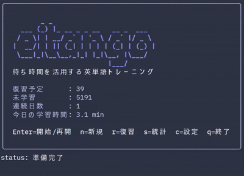

<p align="center">
    
</p>

<p align="center">
  <em>eitango - TUI English Vocabulary Tool</em>
</p>

---

# eitango

`eitango` is an offline English vocabulary trainer with a terminal UI. It uses Bubble Tea for the interactive interface and a local SQLite database for progress tracking.

[日本語README](README.md)


## What It Can Do

- `eitango` opens the home screen, where you can choose modes and change settings in the TUI

<p align="center">
  
</p>

- `eitango learn` starts a standard learning session
- `eitango review` starts a due-only review session
- `eitango stats` shows learning statistics
- `eitango doctor` runs read-only diagnostics on the DB and dictionary
- `eitango validate` validates the embedded dictionary or external CSV / JSONL files
- `eitango import` / `eitango export` / `eitango reset` maintain dictionaries and learning progress

## Installation

### 1. Use GitHub Releases

Published archives include the executable plus `LICENSE`, `THIRD_PARTY_NOTICES.md`, and `third_party/licenses/`. Extract the artifact for your OS and run `eitango`.

### 2. Install with Go

Go 1.26 or newer is required.

```bash
go install github.com/harumiWeb/eitango/cmd/eitango@latest
```

## Quick Start

```bash
eitango
```

You can also start directly in a specific mode.

```bash
eitango learn
eitango review --focus-mode
eitango stats
eitango doctor
```

On first run, `eitango` initializes the local database. By default it uses the embedded `assets/words_core.jsonl` as the seed dictionary.

## Data Directory

- Windows: `%AppData%\\eitango-cli\\`
- macOS: `~/Library/Application Support/eitango-cli/`
- Linux: `~/.local/share/eitango-cli/`

The following files and directories are created there:

- `user.db`
- `config.toml`
- `logs/`

Set `EITANGO_DATA_DIR` to override the default location.

## Command Reference

| Command | Purpose |
| --- | --- |
| `eitango learn [--focus-mode] [--questions N]` | Start a standard learning session |
| `eitango review [--focus-mode] [--questions N] [--restart]` | Start a due-only review session |
| `eitango stats` | Show learning statistics |
| `eitango --license` | Print bundled licenses and notices |
| `eitango doctor` | Run DB / dictionary diagnostics |
| `eitango validate --embedded-core` | Validate the embedded core dictionary |
| `eitango validate --file words.csv --format csv --kind import` | Validate a dictionary file for import |
| `eitango import --file words.jsonl --format jsonl --source my-pack` | Import an external dictionary |
| `eitango export wrong-words --output wrong.csv` | Export difficult words as CSV |
| `eitango export progress --output progress.json` | Export progress as JSON |
| `eitango reset --progress` / `eitango reset --reseed` | Reset learning history / reseed the bundled core |

## Dictionary Data and Licensing

The application code is licensed under [Apache License 2.0](LICENSE). However, the bundled `assets/words_core.jsonl` is vocabulary data with a separate provenance and should not be treated as if Apache-2.0 alone covered it.

In this repository, the bundled core vocabulary is limited to the Leipzig Corpora Collection English News 2024 1M word list and Japanese WordNet (`wnjpn.db`).

- `assets/words_core.jsonl` is the project's curated core vocabulary data
- `meaning_ja` contains Japanese meanings curated with Japanese WordNet as the upstream lexical source
- `frequency_rank` is the bundled-core ranking derived from the Leipzig Corpora Collection English News 2024 1M word list
- `level` is an internal `core-1` through `core-4` bucket, not an upstream dataset label
- the vocabulary generation scripts read local inputs from `tmp/eng_news_2024_1M-words.txt` and `tmp/wnjpn.db`
- raw Leipzig / WordNet inputs are not shipped in release artifacts; generation conditions are pinned in `scripts/vocab/source_manifest.json`
- if you publish or redistribute results that directly or indirectly use Japanese WordNet, keep the recommended attribution wording, links, and license guidance from `third_party/licenses/Japanese-WordNet.txt`

Public-facing Japanese WordNet attribution in released artifacts is expected to include wording at least as explicit as the following examples. If you swap in a different local input version, update the version number as well.

```text
Japanese Wordnet (v1.1) © 2009-2011 NICT, 2012-2015 Francis Bond and 2016-2024 Francis Bond, Takayuki Kuribayashi
https://bond-lab.github.io/wnja/index.en.html
```

```text
日本語ワードネット（1.1版）© 2009-2011 NICT, 2012-2015 Francis Bond and 2016-2024 Francis Bond, Takayuki Kuribayashi
https://bond-lab.github.io/wnja/index.ja.html
```

Before redistributing the repository or packaged artifacts, review:

- [THIRD_PARTY_NOTICES.md](THIRD_PARTY_NOTICES.md)
- [`third_party/licenses/`](third_party/licenses)

In particular, any redistribution that includes `words_core.jsonl` should preserve both the third-party data notices and the Japanese WordNet attribution guidance.

## Development

The application itself runs entirely on Go, but the vocabulary generation pipeline uses Python 3.11 or newer.

```bash
uv sync
go test ./...
go run ./cmd/eitango --help
```

The scripts in `scripts/vocab/` expect local inputs such as `tmp/eng_news_2024_1M-words.txt` and `tmp/wnjpn.db`. End users do not need these files for normal use.

## License

- Application code: [Apache License 2.0](LICENSE)
- Third-party software and data: [THIRD_PARTY_NOTICES.md](THIRD_PARTY_NOTICES.md)
- Reference license texts and data provenance notes: [`third_party/licenses/`](third_party/licenses)
